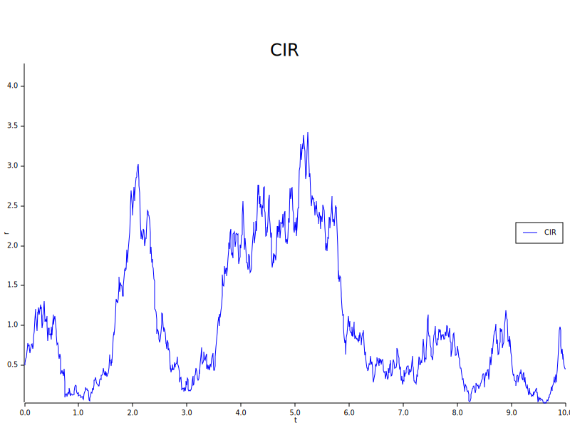

# DiffusionX

[English](README.md) | 简体中文

> DiffusionX 是一个多线程高性能的 Rust 随机数生成和随机过程模拟库。

[](https://docs.rs/diffusionx/latest/diffusionx/)
[](https://crates.io/crates/diffusionx)
[](LICENSE-MIT)

## 已实现功能

### 随机数生成

- [x] 正态分布
- [x] 均匀分布
- [x] 指数分布
- [x] 泊松分布
- [x] $\alpha$-稳定分布

### 随机过程模拟

- [x] 布朗运动
- [x] $\alpha$-稳定莱维过程
- [x] 柯西过程
- [x] $\alpha$-稳定 subordinator
- [x] 逆 $\alpha$-稳定 subordinator
- [x] 泊松过程
- [x] 分数布朗运动
- [x] 连续时间随机游走
- [x] Ornstein-Uhlenbeck 过程
- [x] 朗之万方程
- [x] 广义朗之万方程
- [x] 从属朗之万方程
- [x] 莱维游走 - 具有耦合跳跃长度和等待时间的超扩散过程
- [x] 生灭过程
- [x] 随机游走
- [x] 布朗桥
- [x] Brownian excursion
- [x] Brownian meander
- [x] 伽马过程
- [x] 几何布朗运动


## 使用

### 随机数生成

```rust
use diffusionx::random::{normal, uniform, stable};
fn main() -> Result<(), Box<dyn std::error::Error>> {
    // 生成一个均值为 0.0，标准差为 1.0 的正态随机数
    let normal_sample = normal::rand(0.0, 1.0)?;
    // 生成 1000 个标准正态随机数
    let std_normal_samples = normal::standard_rands(1000);

    // 生成一个 [0, 10) 范围内的均匀随机数
    let uniform_sample = uniform::range_rand(0..10)?;
    // 生成 1000 个 [0, 1) 范围内的均匀随机数
    let std_uniform_samples = uniform::standard_rands(1000);

    // 生成 1000 个标准稳定随机数
    let stable_samples = stable::standard_rands(1.5, 0.5, 1000)?;

    Ok(())
}
```

### 随机过程模拟

```rust
use diffusionx::simulation::{prelude::*, continuous::Bm};
fn main() -> Result<(), Box<dyn std::error::Error>> {
    // 创建标准布朗运动对象
    let bm = Bm::default();
    // 创建持续时间为 1.0 的轨迹
    let traj = bm.duration(1.0)?;
    // 使用时间步长 0.01 模拟布朗运动轨迹
    let (times, positions) = traj.simulate(0.01)?;
    println!("times: {:?}", times);
    println!("positions: {:?}", positions);

    // 计算一阶原点矩，1000 个粒子，时间步长为 0.01
    let mean = traj.raw_moment(1, 1000, 0.01)?;
    println!("mean: {mean}");
    // 计算二阶中心矩，1000 个粒子，时间步长为 0.01
    let msd = traj.central_moment(2, 1000, 0.01)?;
    println!("MSD: {msd}");
    // 计算 TAMSD，100.0 的持续时间，1.0 的 delta，10000 个粒子，时间步长为 0.1，Gauss-Legendre 积分阶数为 10
    let eatamsd = bm.eatamsd(100.0, 1.0, 10000, 0.1, 10)?;
    println!("EATAMSD: {eatamsd}");
    // 计算布朗运动首次通过时间，边界为 -1.0 和 1.0
    let fpt = bm.fpt((-1.0, 1.0), 1000, 0.01)?;
    println!("FPT: {fpt}");
    Ok(())
}
```

### 可视化示例

```rust
use diffusionx::{
    simulation::{continuous::Bm, prelude::*},
};
fn main() -> Result<(), Box<dyn std::error::Error>> {
    // 创建布朗运动轨迹
    let bm = Bm::default();
    let traj = bm.duration(10.0)?;

    // 配置并创建可视化
    let config = PlotConfigBuilder::default()
    .time_step(0.01)
    .output_path("brownian_motion.png")
    .caption("布朗运动轨迹")
    .x_label("t")
    .y_label("B")
    .legend("bm")
    .size((800, 600))
    .backend(PlotterBackend::BitMap)
    .build()?;

    // 生成图像
    traj.plot(&config)?;

    Ok(())
}
```

## 架构与可扩展性

DiffusionX 采用基于 trait 的系统设计，具有高度的可扩展性和性能优化：

### 核心 Trait

- `ContinuousProcess`: 连续随机过程的基本 trait
- `PointProcess`: 点过程的基本 trait
- `DiscreteProcess`: 离散随机过程的基本 trait
- `Moment`: 统计矩计算的 trait，包括原点矩和中心矩
- `Visualize`: 绘制过程轨迹的 trait

### 泛函分布模拟

DiffusionX 为随机过程提供强大的泛函分布模拟功能：

1. **首次通过时间 (FPT)**: 计算过程首次到达指定边界的时间
   ```rust
   // 对于布朗运动过程
   let bm = Bm::default();
   // 计算边界为 -1.0 和 1.0 的首次通过时间
   let fpt = bm.fpt(0.01, (-1.0, 1.0), 1000)?;
   ```

2. **占据时间**: 测量过程在指定区域内停留的时间
   ```rust
   // 对于布朗运动过程
   let bm = Bm::default();
   let traj = bm.duration(10.0)?;
   // 计算在区域 [0.0, 2.0] 内停留的时间
   let occupation = traj.occupation_time(0.01, (0.0, 2.0))?;
   ```

### 扩展自定义过程

1. 添加新的连续随机过程：
   ```rust
   #[derive(Clone)]
   struct MyProcess {
       // 您的参数应该是 `Send + Sync` 以支持并行计算
   }

   impl ContinuousProcess for MyProcess {
       fn simulate(&self, duration: impl Into<f64>, time_step: f64) -> XResult<(Vec<f64>, Vec<f64>)> {
           todo!() // 实现您的模拟逻辑
       }
   }
   ```

2. 实现 `ContinuousProcess` trait 后自动实现
    - 均值 `mean`
    - 均方位移 `msd`
    - 原点矩 `raw_moment`
    - 中心矩 `central_moment`
    - 首次通过时间 `fpt`
    - 占据时间 `occupation_time`
    - 时间平均均方位移 `tamsd`
    - 可视化 `plot`

**示例：**

```rust
use diffusionx::{XError, XResult, random::normal, simulation::prelude::*, utils::write_csv};

/// CIR
#[allow(clippy::upper_case_acronyms)]
#[derive(Clone)]
struct CIR {
    speed: f64,
    mean: f64,
    volatility: f64,
    start_position: f64,
}

impl CIR {
    fn new(
        speed: impl Into<f64>,
        mean: impl Into<f64>,
        volatility: impl Into<f64>,
        start_position: impl Into<f64>,
    ) -> XResult<Self> {
        let speed: f64 = speed.into();
        if speed <= 0.0 {
            return Err(XError::InvalidParameters(format!(
                "The `speed` must be greater than 0, but got {}",
                speed
            )));
        }
        Ok(Self {
            speed,
            mean: mean.into(),
            volatility: volatility.into(),
            start_position: start_position.into(),
        })
    }
}

impl ContinuousProcess for CIR {
    fn simulate(&self, duration: impl Into<f64>, time_step: f64) -> XResult<Pair> {
        let duration = duration.into();
        let num_steps = (duration / time_step).ceil() as usize;

        let initial_x = self.start_position.max(0.0);
        let noises = normal::standard_rands(num_steps);

        let t: Vec<f64> = (0..=num_steps).map(|i| i as f64 * time_step).collect();

        let x = std::iter::once(initial_x)
            .chain((0..num_steps).scan(initial_x, |state, i| {
                let current_x = *state;
                let drift = self.speed * (self.mean - current_x);
                let diffusion = self.volatility * current_x.sqrt().max(0.0);

                let next_x =
                    current_x + drift * time_step + diffusion * noises[i] * time_step.sqrt();
                *state = next_x.max(0.0);

                Some(*state)
            }))
            .collect();

        Ok((t, x))
    }
}

fn main() -> XResudlt<()> {
    let duration = 10;
    let particles = 10_000;
    let time_step = 0.01;
    let cir = CIR::new(1, 1, 1, 0.5)?;
    let traj = cir.duration(duration)?;
    let (t, x) = cir.simulate(duration, time_step)?;
    write_csv("tmp/CIR.csv", &t, &x)?;
    // 均值
    let mean = cir.mean(duration, particles, time_step)?; // or let mean = traj.raw_moment(1, particles, time_step)?;
    println!("mean: {mean}");
    // 均方位移
    let msd = cir.msd(duration, particles, time_step)?; // or let msd = traj.central_moment(2, particles, time_step)?;
    println!("MSD: {msd}");
    // 首次通过时间
    let max_duration = 1000;
    let fpt = cir.fpt((-1, 1), max_duration, time_step)?.unwrap_or(-1.0);
    println!("FPT: {fpt}");
    // 占据时间
    let occupation_time = cir.occupation_time((-1, 1), duration, time_step)?;
    println!("Occupation Time: {occupation_time}");
    // 时间平均均方位移
    let slag = 1;
    let quad_order = 10;
    let tamsd = TAMSD::new(&cir, duration, slag)?;
    let eatamsd = tamsd.mean(particles, time_step, quad_order)?;
    println!("EATAMSD: {eatamsd}");

    // 可视化
    let config = PlotConfigBuilder::default()
        .time_step(time_step)
        .output_path("tmp/CIR.svg")
        .caption("CIR")
        .show_grid(false)
        .x_label("t")
        .y_label("r")
        .legend("CIR")
        .backend(PlotterBackend::SVG)
        .build()
        .unwrap();
    traj.plot(&config)?;
    Ok(())
}
```
**结果：**
```
mean: 0.9957644815350275
MSD: 0.7441251895881059
FPT: 0.38
Occupation Time: 4.719999999999995
EATAMSD: 0.6085042089895467
```


## 基准测试
相关内容请见 [py-diffusionx](https://github.com/tangxiangong/py-diffusionx) 的 **基准测试** 部分。

## 许可证

本项目采用双许可证模式：

* [MIT 许可证](https://opensource.org/licenses/MIT)
* [Apache 许可证 2.0 版本](https://www.apache.org/licenses/LICENSE-2.0)

您可以选择使用其中任一许可证。
